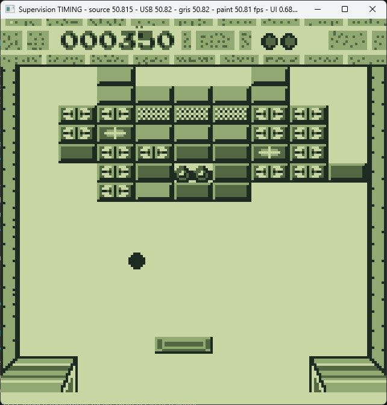
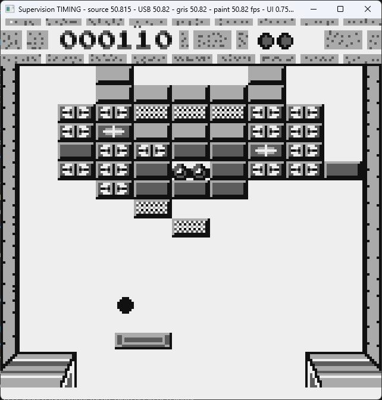

# Supervision USB Video

USB video capture from a real Watara Supervision console to a Windows PC,
using a Raspberry Pi Pico (RP2040). The original LCD can be dead or removed;
the console must still produce its LCD bus signals. This is not an emulator,
HDMI adapter, USB webcam/UVC device, or audio capture device.

[Download v0.1.0](https://github.com/Antviau/supervision-usb-video/releases/tag/v0.1.0)
· [Installation](#download-and-install--step-by-step)
· [Wiring](#wiring-and-hardware-caution)
· [Troubleshooting](#troubleshooting)
· [Build](#build-the-release-configuration)

## Screenshots

Screenshots of the Windows viewer in use. The two shots were captured at
different game moments. Game graphics
remain the property of their respective owners; no ROM is distributed.





## AI-assisted development

This project was developed in large part with AI assistance, using OpenAI
ChatGPT and Codex. A human directed the project, soldered and flashed the
hardware, tested gameplay, and selected the release. AI-generated contributions
were iterated against tests and real-hardware feedback. This disclosure is not
a claim that the code is error-free or independently verified.

## First release: v0.1.0

The release includes two components: firmware that captures the console's
LCD signals on the Pico, and a Windows application that displays the video
received over USB. You continue playing with the console's own controls.

- 160 x 160 image, four grayscale levels, green or neutral palette.
- Approximately 50.8 video updates per second on the tested console.
- Four shades reconstructed from successive LCD fields (partial image scans).
- Low-latency USB capture with latest-frame display.
- Buffered drawing: the viewer prepares each image before displaying it.
- Borderless fullscreen, native-resolution PNG screenshots, raw `.svf` recording.

### Known limitations

Paddle motion can remain uneven, and moving edges can show temporal mixing.
The release does not claim perfect smoothness, zero dropped frames, universal
compatibility, or 100% equivalence to the physical LCD's response. Monitor
refresh and application paint rate are not measurements of input-to-photon
latency. No motion interpolation is used. Tests were made on one modified
console and Windows setup; other hardware may need investigation.

## Requirements

To use the prebuilt release you need Windows 10/11 x64, an original Raspberry
Pi Pico/RP2040, a USB **data** cable, and a working Supervision motherboard
producing its LCD signals. A working original LCD is not required. This release
does not target Pico 2/RP2350, Linux/macOS, or Windows ARM64. You need soldering
equipment and a way to verify wiring/voltage levels. No Python, Pico SDK, Visual
Studio, or administrator privileges are normally needed to run the viewer.
**Zadig is required to install the WinUSB driver**, and that setup step requires
administrator approval. Zadig is downloaded separately, not bundled.

## Download and install — step by step

1. Open [Releases](https://github.com/Antviau/supervision-usb-video/releases).
2. Download `supervision-usb-video-v0.1.0-windows-x64.zip` from v0.1.0's Assets.
   GitHub's automatically generated "Source code" archives are for building,
   not the ready-to-run viewer.
3. Extract the ZIP to a writable folder, e.g. a folder under Documents. Do not
   run the viewer from inside the ZIP. Keep the documentation and licenses.
4. Complete the wiring and flash `SupervisionCapture.uf2` as described below.
   If this release's firmware is already installed, skip flashing.
5. **Install WinUSB with Zadig** using the required driver setup below.
6. Run `SupervisionViewer.exe` and turn on the console.

The package contains:

- `SupervisionViewer.exe`: the Windows x64 viewing application.
- `SupervisionCapture.uf2`: the matching RP2040 capture firmware.
- Instructions, release notes, licenses, and SHA256 checksums.

### Flash a new Pico

1. Leave the console powered off. Unplug the Pico USB cable.
2. Hold the Pico's BOOTSEL button while plugging it into the PC with a USB data
   cable. Release BOOTSEL once Windows shows the `RPI-RP2` drive.
3. Copy the packaged **`SupervisionCapture.uf2`** onto that drive.
4. The bootloader drive disappears when flashing completes. The Pico should
   reconnect as the capture device, not remain a storage drive.
5. Continue with the required Zadig driver installation below before opening
   the viewer.

This replaces the firmware currently loaded on that Pico. Use the UF2 from
the Windows release package. BOOTSEL flashing does not depend on the
application firmware remaining responsive.

### Required Windows driver setup — Zadig

**Installing WinUSB with Zadig is a mandatory first-installation step.**
Flashing the UF2 alone is not sufficient. The firmware exposes a
vendor-specific USB interface, not a webcam or serial port.
With the Pico connected normally (not in BOOTSEL mode), look for
`Supervision USB video capture`; verify its hardware IDs in Properties >
Details: **`VID_CAFE`, `PID_4020`, interface 0**. The bootloader drive alone is
not the capture interface.

Install the capture device's driver as follows:

1. Download Zadig only from [its official site](https://zadig.akeo.ie/).
2. Run it as administrator and enable **Options > List All Devices** if needed.
3. Select **Supervision USB video capture** and verify the USB ID is
   **CAFE / 4020**. Stop if the identity does not match.
4. Choose **WinUSB**, not libusbK, libusb-win32, or USB serial.
5. Click Install Driver or Replace Driver and approve the administrator prompt
   if requested. Wait for completion, then reconnect the Pico and restart the
   viewer.

Changing a different device's driver can break that device. Never choose a
keyboard, mouse, hub, storage drive, or the `RPI-RP2` bootloader. A device
already working with WinUSB does not need to be changed. The VID/PID are
prototype identifiers, not a commercial allocation. You only need to perform
this setup once per Windows installation/device binding; you do not need to
reinstall a working WinUSB driver every time you launch the viewer.

### First launch and expected result

1. Complete the wiring with power disconnected, then connect the Pico to USB.
2. Close any other capture viewer; only one application should own the capture
   interface at a time.
3. Open `SupervisionViewer.exe`. A waiting/status window is normal while the
   console is off or a complete field history is not yet available.
4. Turn on the Supervision. Its actual game image should appear.
5. Check the title for source/USB/gray/paint rates around 50.8/s during stable
   operation. Counters are cumulative; watch whether they **increase**, rather
   than assuming a nonzero historical value means a current failure.
6. Press F11 for fullscreen or resize the window. Graphics are intentionally
   nearest-pixel scaled; the native console image is only 160 x 160 pixels.

It uses Windows APIs and a static MSVC runtime; no SDL/libusb DLL bundle is
required. Prebuilt binaries are not code-signed. If your security policy blocks
an unsigned application, review/build the source or use your normal approval
process; do not disable protection just to run this project.

## Wiring and hardware caution

Eight connections are required, including ground and the LINE_LATCH signal.
Solder directly to the console mainboard's LCD connector pins; a faulty LCD
board or its interconnect can degrade the captured signals. Connector
numbering below follows the Supervision LCD connector; verify orientation
and signals on your actual board before soldering.

| LCD connector | Pico |
| --- | --- |
| 1 — GND | GND |
| 2 — DATA0 | GP16 |
| 3 — DATA1 | GP17 |
| 4 — DATA2 | GP18 |
| 5 — DATA3 | GP19 |
| 6 — PIXEL_CLOCK | GP20 |
| 7 — LINE_LATCH | GP22 |
| 9 — FRAME_POLARITY | GP21 |

Power the Pico through USB. Do not connect the LCD supply pins to Pico GPIO.
Turn off and disconnect power before wiring. Check signal voltages against
the RP2040 electrical limits and provide appropriate level translation where
needed. Direct wiring on the tested console is not a safety guarantee for
every model. This firmware overclocks the RP2040 to 240 MHz; stability is not
guaranteed on every Pico. Hardware modifications are at your own risk.

## Viewer controls

- F11: borderless fullscreen.
- G: green/neutral grayscale palette.
- P: save a 160 x 160 PNG in the working directory.
- Escape: exit.
- S: exchange intermediate shades (diagnostic; leave unchanged normally).
- M: legacy pair-decoding motion cleanup; not applied to the default
  three-field reconstructed frames.

Example commands:

```powershell
.\SupervisionViewer.exe --scale 4
.\SupervisionViewer.exe --record gameplay.svf
.\SupervisionViewer.exe --timing-log timing.csv
```

Raw recording occurs before grayscale reconstruction/display. A `.svf` file
stores successive 40-byte `SVF0` headers and 6,400-byte packed raw-field
payloads. See [docs/PROTOCOL.md](docs/PROTOCOL.md). Close the viewer normally
before reading a timing CSV; the file is locked while recording. Paint events
are submission measurements, not physical scanout measurements.

## Build the release configuration

The repository contains the Windows application, Pico firmware, shared USB
protocol definitions and automated tests. Use the following build options
to enable this release's three-field grayscale reconstruction, low-latency
USB reads and buffered drawing:

Windows host: Visual Studio Build Tools with Desktop development with C++.

```powershell
.\scripts\build-windows.ps1 -LcdSum3Default -LowLatencyDefault -BufferedPaintDefault
```

The executable is `build/windows-x64/host/SupervisionViewer.exe`.

Firmware: Pico SDK for Windows, RP2040/Pico toolchain. The release firmware
was built using Pico SDK 1.5.1. Build this target:

```powershell
.\scripts\build-firmware.ps1 -Targets supervision_capture_fast_field_handoff
```

The artifact is `build/firmware/supervision_capture_fast_field_handoff.uf2`.
This build artifact is packaged as `SupervisionCapture.uf2` in the Windows
download. Other targets in `firmware/CMakeLists.txt` are alternative or
diagnostic capture implementations, not the firmware supplied with v0.1.0.

Run host tests with the Visual Studio CTest executable, e.g.:

```powershell
ctest --test-dir build/windows-x64 --output-on-failure
```

If CTest is not on PATH, use the Developer PowerShell/command prompt supplied
with Visual Studio or its bundled CTest executable. For a custom Pico SDK
installation, set `PICO_SDK_PATH` to its `pico-sdk` directory and ensure ARM
GCC, CMake and Ninja are installed. Initialize the SDK's required submodules.

Rebuilding may change binary hashes due to toolchain versions/build metadata.
The release assets contain hardware-tested binaries; checksums identify
those exact files, not a claim of reproducible bit-for-bit builds.

## Troubleshooting

| Symptom | Checks |
| --- | --- |
| `RPI-RP2` never appears | Hold BOOTSEL while connecting; try a known USB data cable and another port. |
| Only a bootloader drive appears | Flash the packaged UF2, then reconnect without holding BOOTSEL. |
| Viewer cannot find/open Pico | Complete the required Zadig installation; verify CAFE/4020 and WinUSB; close other capture programs; reconnect USB. |
| Pico detected, but no game image | Power on console; verify common ground, DATA0–3, CLK, POLARITY and LINE_LATCH at the mainboard; check firmware target. |
| Diagonals, lines, unstable sync | Recheck pin orientation, LINE_LATCH/GP22, solder joints and wiring; inspect signal integrity and console power. Use the packaged firmware. |
| Source/drop counters increase continuously | Check power, wiring/signal levels and USB connection; startup/reconnect drops alone are not proof of ongoing loss. |
| Viewer appears slow/choppy | Check source/USB/gray/paint rates; close other capture apps. Uneven motion is a known limitation; changing monitor refresh alone may not resolve it. |
| PNG cannot be saved | Extract/run from a writable working directory; P writes there, not necessarily beside the EXE if launched from a different directory. |
| Timing CSV cannot be opened | Exit the viewer normally to flush/close it before reading. |

To report a problem, include Windows version, Pico/console model, driver name,
firmware/viewer version, whether it occurs after startup, and the rates/drop
counter changes. A short timing log or screenshot can help. Inspect files
before uploading; do not include credentials or unrelated desktop information.
Raw recordings may contain game content; share only content you may distribute.

## Contributing

Fork the repository, make a focused change, and submit a pull request. Keep
the release's capture and grayscale behavior as the baseline, add relevant
tests, and report real-hardware results separately from synthetic tests.
Avoid silently adding interpolation, suppressing legitimate game frames, or
claiming perfect fidelity from a paint-rate counter. No game ROMs are needed
or included. Respect the licensing split described below.

## Licensing and credits

Our original contributions are licensed under [MIT](LICENSE). The derived
capture firmware remains subject to DutchMaker's **NON-COMMERCIAL USE LICENSE**;
see [THIRD_PARTY_NOTICES.md](THIRD_PARTY_NOTICES.md) and the included license.
The complete firmware therefore is not unrestricted, OSI-approved open source.
Forking and non-commercial improvements are welcome subject to those terms.
MIT does not override upstream restrictions.

Thanks to Ruud van Falier / [DutchMaker](https://github.com/DutchMaker/Supervision-LCD-v2)
for the capture/grayscale reference, and [xrip](https://github.com/xrip/watara-supervision-lcd)
for the earlier RP2040 capture work. The Pico SDK and TinyUSB have their own
permissive licenses, included with the distribution. No endorsement by these
authors, Raspberry Pi, OpenAI, or the console manufacturer is implied.
